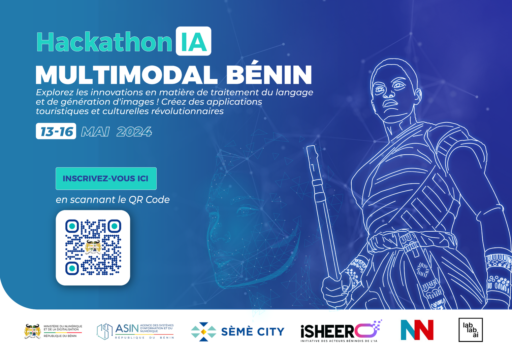

## **Collected Resources**

### Yoruba

https://towardsdatascience.com/simple-machine-translation-yor%C3%B9b%C3%A1-to-english-1b958ccdc8a1

https://www.kaggle.com/datasets/kingabzpro/yoruba-translation-model

https://huggingface.co/datasets/odunola/yoruba-english-pairs

https://aibusiness.com/nlp/build-multilingual-ai-solutions-with-cohere-s-new-aya-model#close-modal

https://huggingface.co/datasets/google/fleurs

https://huggingface.co/datasets/google/fleurs/viewer/yo_ng?row=0

https://huggingface.co/datasets/odunola/yoruba_audio_data

### Fon

https://github.com/bonaventuredossou/ffr-v1

https://zindi.africa/competitions/ai4d-takwimu-lab-machine-translation-challenge/data

https://github.com/kevindegila/En-Fon-Translator/tree/master

### ASR Fon

https://github.com/laleye/pyFongbe/tree/master
https://github.com/bonaventuredossou/fonasr/tree/main
https://www.assemblyai.com/blog/end-to-end-speech-recognition-pytorch/
https://github.com/bonaventuredossou/multitask_fon
https://colab.research.google.com/drive/1aFgzrUv3udM_gNJNUoLaHIm78QHtxdIz

### Wave2vec

https://www.kaggle.com/code/kingabzpro/wave2vec-asr-wolof
https://github.com/kingabzpro/WOLOF-ASR-Wav2Vec2

### Others

https://github.com/laleye/pyFongbe/tree/master/data

https://github.com/bonaventuredossou/ffr-v1/tree/master/FFR-Dataset

https://huggingface.co/datasets/yoruba_wordsim353

https://huggingface.co/datasets/odunola/yoruba_audio_data

https://huggingface.co/datasets/odunola/yoruba-english-pairs

https://huggingface.co/datasets/godwinh/fongbe-asr

https://zenodo.org/records/6604637
